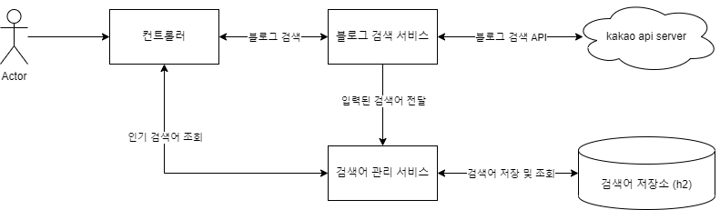

# Simple Blog Finder

> 각종 블로그 정보 검색 및 조회 서비스
> 

# 요구사항

## 1. 블로그 검색 기능

- 키워드를 통해 블로그를 검색 할 수 있다
- 검색 결과에서 Sorting 기능 제공 (정확도 & 최신순)
- 검색 결과는 Pagination이 기본 제공된다
- 검색 소스는 카카오 API를 활용한 결과 데이터로 추출된다
    - 추후 신규 API도 추가 될 수 있음

## 2. 인기 검색어 목록

- 사용자들이 많이 검색한 순서대로, 최대 10개의 검색 키워드를 제공한다
- 검색어 별로 검색된 횟수도 함께 조회 할 수 있다

# 사용자 시나리오



1. 블로그 검색
    1. 검색 요청 시 블로그 검색 서비스를 통해 kakao의 블로그 검색 API 요청 및 응답 처리
2. 인기 검색어 조회
    1. 검색 시점에 검색어 관리 서비스에서 검색어를 별도 저장
    2. 해당 검색어에 대한 카운팅 및 이후 랭킹 집계 등에 활용

# API docs

| URL | Method | Params | Description | Response |
| --- | --- | --- | --- | --- |
| /api/blog-search | GET | searchApiType : 검색 사이트 종류 (default : kakao)<br>searchValue : 검색어<br>size : 반환 받는 한 페이지의 크기 (default : 10)<br>sort : 검색시 정렬 순 (default : accuracy)<br><t>accuracy(정확도순), recency(최신순)<br>page : 반환 받는 목록의 페이지 index (default : 1) | 검색어를 입력하여 검색 정보 반환 | KakaoBlogResponse |
| /api/search-term/ranking | GET |  | 그간 검색된 검색어 중 상위 10위권 내 검색어 목록 반환 | List<SearchTermDto> |

## KakaoBlogResponse

```json
{
  "meta": {
    "total_count": 0,
    "pageable_count": 0,
    "end": true
  },
  "documents": [
    {
      "title": "string",
      "contents": "string",
      "url": "string",
      "blogname": "string",
      "thumbnail": "string",
      "datetime": "2023-03-22T13:32:11.040Z"
    }
  ]
}
```

## SearchTermDto

```json
{
  "searchTermValue": "string",
  "totalCount": 0
}
```

[Notion Link](https://trapezoidal-curiosity-d38.notion.site/Simple-Blog-Finder-26c6ff3d51ee47eb8107a68270824f21)

[Eextuable Jar](executable-jar/simple-blog-finder-1.0.0-SNAPSHOT.jar)